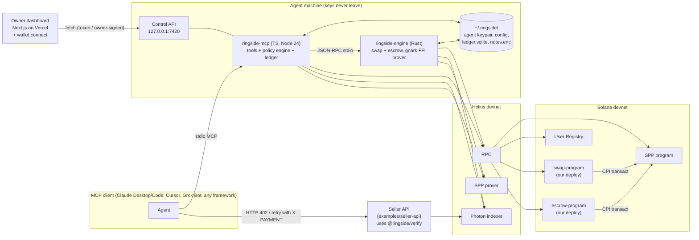
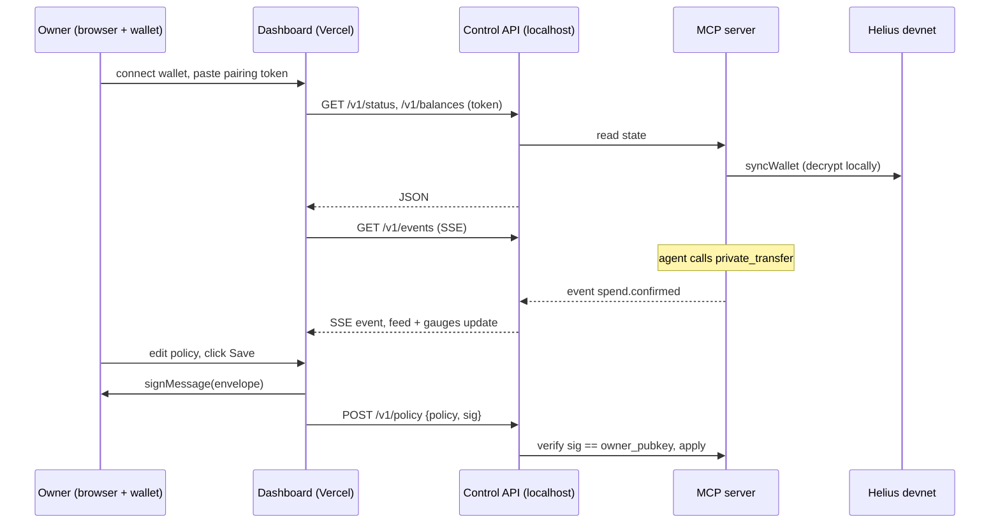

# PRD: ringside-mcp (working name)

Private agent payments on Solana via Helius Privacy (Solana Rings). An MCP server plus an owner dashboard. One public repo, one submission.

| | |
|---|---|
| Owner | Mayor (FUOYE) |
| Event | Colosseum Crypto World's Fair hackathon |
| Network | Solana **devnet only** (Helius Privacy is beta, devnet only, mainnet not launched) |
| Hard deadline | **Mon Oct 12, 11:59 PM PT = Tue Oct 13, 07:59 WAT** |
| Internal submit target | Mon Oct 12, 22:00 WAT (10 h buffer) |
| Submission | Public repo, pitch video (2 min max), demo video (3 min max) |
| Prize targets | Solana track, $5k Public Good Prize, $5k University Prize |
| Doc status | Build-ready. Items tagged **(verify)** are not confirmed from source and must be checked in code before relying on them. |

---

## 1. Problem

AI agents increasingly pay for things (APIs, data, compute, bounties). On Solana today every agent payment is a public transfer: anyone can read the agent's budget, its vendors, its pricing, and its strategy from the explorer. Businesses will not run agents whose entire spend graph is public.

Existing Solana privacy MCPs (b402, ZeroK, SNAP, oracle) exist, but generally rely on separate pools, fixed denominations, or custom infra, and none give the human owner real control over what the agent can spend.

Helius Privacy (Solana Rings, built on the open-source Solana Privacy Program "SPP", repo `helius-labs/zolana`) gives confidential transfers that settle natively on Solana in one transaction with asset and amount encrypted. There is no MCP or agent-ready wrapper, no owner guardrails, and no seller-side verification flow for it yet.

## 2. Users

| User | Needs | What we give them |
|---|---|---|
| **Agent developer** | Drop-in private payments for any MCP client (Claude Desktop/Code, Cursor, Grok Bot, LangChain, etc.) | `npx ringside-mcp` stdio server, ~22 typed tools, one config file |
| **Agent owner** (human) | Let the agent pay without handing it unlimited money; see what it did; stop it instantly | Policy engine (caps, allowlist, kill switch) + Next.js dashboard with Solana wallet connect; policy changes signed by the owner wallet |
| **API seller** | Accept private agent payments and verify them server-side | `create_payment_request` + `verify_payment` tools and a reusable `@ringside/verify` library for an x402-style 402 flow |

## 3. Goals and non-goals

### Goals (must-have, P0)
1. MCP tools covering **every** example in `helius-labs/zolana-examples` (TS/Rust client examples + swap-program + escrow-program). See coverage matrix in section 8.2.
2. Core client tools working end to end on **devnet** with real Helius endpoints.
3. Owner policy engine: per-tx, per-session, per-day caps; recipient allowlist; asset allowlist; kill switch; read-only mode.
4. Seller flow: `create_payment_request` + `verify_payment` with replay protection.
5. Dashboard: wallet connect, balances, live activity feed, policy editor (owner-signed), kill switch, view-only auditor mode.
6. Demo: buyer agent in Claude pays a seller API privately, seller verifies, dashboard updates live, explorer shows no amount. Plus an escrow bounty demo.

### Should-have (P1)
- Swap and escrow tools running on devnet against our own deployments (fallback tiers in 6.4).
- Owner approval queue for payments above a threshold.
- Streamable HTTP transport (besides stdio).

### Non-goals
- Mainnet. Custom Rings / anonymous rings / enterprise REST API (`privacy.helius.xyz/v1`, gated). Relayers.
- Trustless third-party escrow release (the example escrow is creator-reclaim only, see 6.3).
- Fiat on/off ramp, embedded wallets (WaaS integration not live).
- Production trusted setup for swap/escrow circuits (we use the repo's insecure test keys, devnet only).
- Mobile app.

## 4. Positioning and differentiators

1. **Helius-native, any amount, no separate pool.** Uses the canonical SPP program and shared state tree. Any SOL/SPL/Token-2022 amount in base units, no fixed denominations, single-transaction settlement.
2. **Owner-in-the-loop controls.** Spend caps, allowlist, kill switch, view-only auditor key. Agent can never loosen its own policy: there is no MCP tool that writes policy; changes require an ed25519 signature from the owner wallet.
3. **Seller side included.** `verify_payment` lets any API accept private agent payments (x402-style 402 then retry with proof header). Competitors focus on the payer only.
4. **Full ring toolkit.** Not just transfer: interface setup, history, confidential maker/taker swap, timelock escrow (agent bounties, milestone budgets).
5. **Public good.** MIT licensed, npm package, reusable verify library, documented patterns for running SPP ZK programs from an agent.

## 5. Ground truth from the repo and docs (read before coding)

Source: `helius-labs/zolana-examples` @ `3069d79` (Sep 24 2026), Helius privacy docs (llms.txt, sdk, endpoints, addresses, transfer, read-history guides), npm registry, devnet RPC queries on Oct 8 2026.

### 5.1 Versions and toolchain
| Item | Value |
|---|---|
| TS SDK | `@heliuslabs/zolana` on npm: `latest` = **0.3.1-alpha** (docs pin `^0.3.1-alpha`); `alpha` tag = 0.4.0-alpha. **Pin `0.3.1-alpha` exactly.** The examples repo pulls `v0.3.0-alpha` via git+ssh; do not copy that (needs SSH key). |
| TS SDK subpath exports | `.`, `./client`, `./wallet`, `./keypair`, `./addresses`, `./interface`, `./transaction`, `./instructions`, `./ring` |
| Other TS deps | `@solana/kit ^8.3.0`, `@solana-program/system 0.14.1`, `@solana-program/token 0.16.1`, `dotenv`, `tsx`, TypeScript |
| Node / pnpm | **Node >= 24** (SDK `engines`), pnpm 11.18.0 |
| Rust crates | `zolana-client` (features `indexer-api`, `solana-rpc`), `zolana-interface`, `zolana-program`, `zolana-keypair`, `zolana-transaction`, `zolana-wallet`, all git tag **`v0.3.0-alpha`** |
| Rust / Solana | Rust 1.98.1 (docs), Agave CLI v4.0.2, SBF tools `v1.54` (CI) |
| Go | **Go 1.27.1+** needed to build swap/escrow `prover`, `sdk`, `test` (gnark circuits compiled to a c-archive via `zolana-gnark-ffi-prover-build`) |
| Zolana checkout | Circuits' `go.mod` expects a `zolana` checkout (tag v0.3.0-alpha) **as a sibling of the `zolana-examples` checkout** |
| Localnet | `cargo install --git https://github.com/helius-labs/zolana --tag v0.3.0-alpha zolana-cli` then `zolana dev start` (RPC :8899, indexer :8784, prover :3001) |

### 5.2 Endpoints (devnet)
- Docs: one URL serves RPC + indexer + prover: `https://devnet.helius-rpc.com/?api-key=<KEY>`.
- `typescript-client/src/lib.ts` actually uses separate hosts: `INDEXER_URL=https://d2xah7tnhdhcom.cloudfront.net`, `PROVER_URL=https://d21ni15goiip6l.cloudfront.net`; `.env.example` mentions an ELB host. Support overrides `ZOLANA_INDEXER_URL` / `ZOLANA_PROVER_URL`; default to the lib.ts values, fall back to single URL **(verify which works on day 1)**.
- Custom Rings RPC (not used): `https://d24brah9h1i4q9.cloudfront.net`.

**Oct 9 verification:** The separate CloudFront indexer and prover defaults worked for read-only sync and health. The single Helius RPC URL did not serve those calls in the earlier check. A funded upstream transfer using SDK `0.4.0-alpha` reached the prover and received HTTP 502; the pinned `0.3.1-alpha` transfer path failed at indexer `getMerkleProofs` with `API_JSON_RPC`. The endpoint setup is usable for registration and deposit, but the proof path remains unverified and M1 is blocked.

### 5.3 On-chain addresses (devnet)
| Account | Address | Devnet status (queried Oct 8) |
|---|---|---|
| Solana Privacy Program (SPP) | `sppXZU59VoYodv9Accs4hHNTjYiuYmDFyFVjUjPxFsG` | Deployed, executable |
| User Registry Program | `regyS5rkAcw2YzDJCmTwCTHs2s246FXxbmuRZ42u2PD` | Deployed, executable |
| State Merkle tree | `trEEbaNobcTESNmtsPBj3FX27q5sDCQePV2kb12FYho` | Live |
| Native SOL interface PDA | `GGk4JbLExpASWVCAtAVdxZ65BCQsj8WN5TsL6v8Dd1c8` | Live |
| Swap program `declare_id!` | `US517G5965aydkZ46HS38QLi7UQiSojurfbQfKCELFx` | **NOT a program on devnet** (plain system account) |
| Escrow program `declare_id!` | `2ehy1rrRKT3KEVNN6pLmHeiUedwazPZezXXhwaLjCt5G` | **Does not exist on devnet** |

**Conclusion:** swap and escrow are **not deployed**. Their `Cargo.toml` says the default `insecure-test-setup` feature is on "because this program is an example, never a devnet or mainnet deployment". We must deploy them ourselves under **our own program keypairs** (we do not hold the vanity ID keys), which means patching `declare_id!` and rebuilding. Verifying keys are insecure deterministic test keys: acceptable for a devnet demo with test funds (a forged proof can only move UTXOs owned by our own program PDAs), never for mainnet. Say this in the README.

### 5.4 SDK facts that shape the design
- `ShieldedKeypair.fromKeypair(SigningKey.fromEd25519Bytes(seed))`: Solana signer and private wallet derive from the **same Ed25519 seed** (Solana CLI keypair file, first 32 bytes). `toSolanaSigner()`, `shieldedAddress()`.
- The SDK returns instructions or compiled transactions; **the app signs and sends** (`sendAndConfirmFactory` / `sendTransactionFactory` in `lib.ts`; tx config `computeUnitLimit: 450_000`, `loadedAccountsDataSizeLimit: 64 MiB`, message `version: 1`).
- After sending, outputs are fetched with `client.getShieldedTransactionsBySignature(sig, atSlot(slot))` and decrypted locally with `decryptToBalances` or via `Wallet` + `syncWallet`.
- Higher-level helpers exist in 0.3.1-alpha (`.d.ts` inspected): `buildDepositTransaction`, `buildTransferTransaction({client, wallet, keys, feePayer, recipient: Address|ShieldedAddress, asset?, amount, approve?})`, `buildWithdrawalTransaction`, `buildSplitTransaction`, `buildMergeTransaction`, `resolveRegisteredAddress({rpc, owner})`, `isWalletRegistered`, `fetchViewingKeyOwners`, `syncPersistedWallet` / `savePersistedWallet` / `loadPersistedWallet`, `walletSnapshotCipher`, `parseAmount` / `formatAmount`, `fetchAssetMetadata`. Prefer the example-level calls for P0 (proven paths); use the high-level helpers where they save time **(verify behavior)**.

**Oct 9 helper check:** `buildDepositTransaction` and registration succeeded on devnet. `buildTransferTransaction` found the registered seller but failed during proof input lookup; transaction construction, send, and confirmation remain unverified on devnet.

**Oct 9 localnet check:** With upstream `zolana dev start` (release tag `v0.3.0-alpha`) and SDK `0.3.1-alpha`, registration, `buildDepositTransaction`, `buildTransferTransaction`, and `buildWithdrawalTransaction` all produced confirmed localnet transactions. The seller's private balance increased and a withdrawal confirmed. This verifies the helper behavior on localnet; devnet remains blocked by its proof services. The documented `zolana dev start` command and default ports were confirmed.
- History entries (`wallet.privateTransactions()`): `{ id: {signature, slot, index}, kind, direction, status, asset, amount, counterpartyViewingPublicKey? }`. This is what `verify_payment` matches on.
- **Default ring is confidential, not anonymous:** asset + amount (+ optional memo) private; **sender and recipient public**; tx hash public. Deposits and withdrawals reveal everything. Pitch line: "funding is public, payments are private".
- A transfer to a recipient **without** a registered private wallet resolves to a public withdrawal. We block this by default.
- Wallet error codes include `WALLET_RECIPIENT_NOT_REGISTERED`, `WALLET_INSUFFICIENT_BALANCE`, `WALLET_NOTE_RESERVED` (SDK has UTXO reservation, TTL 120 s). Map them to friendly tool errors.
- `LocalShieldedKeys.fromKeys({address, viewingKeys, nullifierKey})` and `ViewingKey.fromBytes` exist: a view-only key bundle (viewing + nullifier key, no signing key) can decrypt history and detect spends without spending authority **(verify nullifier key is required and sufficient)**.

### 5.5 Swap and escrow program facts
Both are Pinocchio "SPP ZK programs": verify a small Groth16 proof of their own rules, then CPI SPP `transact` with a PDA signer. They store no state and own no accounts.

**Swap** (`swap-program/`, `swap_program.md`)
| Ix | Tag | What | Signer |
|---|---|---|---|
| `make` | 2 | Lock maker's source funds into an order UTXO owned by PDA `[b"order_authority"]`; order terms in `utxo_data`; marker message tagged to the taker | Maker |
| `take` | 3 | Before expiry: spend order UTXO + taker's destination UTXO; source to taker, destination to maker (derived blinding); any holder of the preimage may take | Any fee payer |
| `take_verifiable_encryption` | 5 | Same, but only the designated taker; destination ciphertext proven in-circuit (BSB22 commitment, 192 B proof) | Taker |
| `cancel` | 4 | After expiry: order UTXO back to maker | Maker |

- Order terms (`OrderTerms`): `destination_mint`, `destination_amount`, `destination` (maker ShieldedAddress), `taker` (Solana address), `expiry` (unix s), `take_mode` (0 = take, 1 = take_verifiable_encryption).
- Rust SDK (`swap-sdk`): `OrderUtxo`, `OrderMarker`, `Make`/`Take`/`TakeVerifiableEncryption`/`Cancel` builders with `.instruction()`, `MakeProofInputParams`, `TakeProofInputParams`, `TakeVerifiableEncryptionProofInputParams`, `CancelProofInputParams`, `SppTxHashes::new`, `SwapProverClient::{prove_make, prove_take, prove_take_verifiable_encryption, prove_cancel}`, discovery `index_taker` / `index_maker` / `scan_taker` / `scan_maker`, `order_authority_pda()`.
- The SPP transfer proof comes from the normal remote prover (`client.indexer().prove_transact(...)`); the swap circuit proof is generated **in-process** via gnark FFI from `build/gnark/<circuit>/{pk,vk}.bin` (generated with `swap-prover-setup <circuit> build/gnark/<circuit> --insecure-test-keys`, checked by `swap-keys.CHECKSUM`).
- The full orchestration (UTXO selection, `prepare_output_blindings`, `encrypt_transaction_data`, `ExternalData`, marker) lives in **tests**, not the SDK: `test/tests/swap.rs` (make + take), `take_verifiable_encryption.rs`, `cancel.rs`. The engine ports these.
- Bench: ~250-394k CU per ix, proving 81-245 ms, tx 814-1188 bytes (make is close to the 1232-byte limit; use v0 + ALT if needed).

**Escrow** (`escrow-program/`, `timelock_escrow.md`)
| Ix | Tag | What | Signer |
|---|---|---|---|
| `escrow` | 0 | Lock creator funds into an escrow UTXO owned by PDA `[b"escrow_authority"]`; terms `(owner_hash, unlock)` private | Creator |
| `withdraw` | 1 | After `now > unlock`: escrow UTXO back to the **creator's** `owner_hash` only | Creator |

- **There is no "release to beneficiary".** The README's "release or reclaim" is the creator withdrawing after unlock. Our bounty flow composes `withdraw` + private transfer (section 8, `escrow_release`), not atomic, policy gated.
- No marker / discovery: the creator **must persist the escrow UTXO preimage** (`EscrowUtxo` incl. `blinding`) locally or the funds are hard to recover. Engine stores notes encrypted on disk.
- Rust SDK (`escrow-sdk`): `EscrowTerms {creator, unlock_timestamp}`, `EscrowUtxo {terms, blinding, asset, amount}`, `Escrow` / `Withdraw {creator, payer, tree, withdraw_proof, unlock_timestamp, spp_proof}` builders, `EscrowProofInputParams`, `WithdrawProofInputParams`, `EscrowProverClient::{prove_escrow, prove_withdraw}`, `escrow_authority_pda()`. Orchestration reference: `test/tests/escrow.rs`.

## 6. Architecture

### 6.1 Decision
- **TypeScript MCP server** (`packages/mcp`) owns: MCP transport, tool schemas, policy engine, ledger, local control API for the dashboard, and all core client tools via `@heliuslabs/zolana`.
- **Rust sidecar `ringside-engine`** (`engine/`) owns swap + escrow. Reason: the circuits are gnark (Go) behind a Rust FFI, and all builders/indexers are Rust-only; porting to TS is not feasible in 4 days. The TS server spawns the engine lazily as a long-lived child process speaking **newline-delimited JSON-RPC over stdio** (`ringside-engine serve`). The engine loads the same keypair file itself; **keys never cross the pipe**. The engine builds, proves, signs, sends, and returns `{signature, slot, ...}`.
- **Capability detection:** if `RINGSIDE_ENGINE_PATH` is unset or `engine.health` fails, swap/escrow tools are still listed but return `ENGINE_UNAVAILABLE` with setup instructions. Core tools never depend on Rust.
- **Next.js dashboard** (`apps/dashboard`, Vercel) talks to the local MCP server through a localhost **control API** (read with pairing token, write with owner wallet signature). Hosted auditor mode works without a local agent.

### 6.2 Diagram


### 6.3 Key flows
- **Pay (buyer):** policy check, resolve recipient via `resolveRegisteredAddress`, sync, select UTXOs, `ConfidentialTransfer.send`, `sign`, `client.proveTransact`, `transactInstruction`, send, confirm, write ledger, emit event.
- **Verify (seller):** sync seller wallet (persisted snapshot for speed), find inbound history entry whose `id.signature` matches, check asset/amount/status, check sender (fee payer from `getTransaction`, public in default ring) and optional `counterpartyViewingPublicKey` via `fetchViewingKeyOwners`, check nonce + expiry + not previously consumed.
- **Escrow bounty:** `escrow_lock` (amount hidden), dashboard shows countdown, after unlock owner approves, `escrow_release` = engine `withdraw` then core `private_transfer` to the hunter.

### 6.4 Swap/escrow deployment plan and fallback tiers
Deployment steps (engine `scripts/deploy-programs.sh`):
1. Vendor `zolana-examples` (pinned commit `3069d79`) and `zolana` (tag `v0.3.0-alpha`) as **sibling** git submodules under `engine/vendor/`.
2. `solana-keygen new -o keys/swap-program.json` and `keys/escrow-program.json`; apply `engine/patches/declare-id.patch` replacing `declare_id!` in both `program/src/lib.rs` (SDKs reference `swap_program::ID` / escrow ID so they follow).
3. `cargo build-sbf --manifest-path program/Cargo.toml --tools-version v1.54 -- --features bpf-entrypoint` for each.
4. Generate insecure test keys: `swap-prover-setup {make,take,cancel,take_verifiable_encryption} build/gnark/<c> --insecure-test-keys` and the escrow equivalent (escrow setup binary in `escrow-program/prover/src/bin/setup.rs`, name **(verify)**); check against `*.CHECKSUM`.
5. `solana program deploy --url devnet --program-id keys/<x>.json target/deploy/<x>.so`. Budget devnet SOL for program rent: check `.so` size, expect roughly 1-3 SOL each **(verify)**. Get SOL from faucet early (Thu/Fri), faucet is rate limited.
6. Smoke test: `ringside-engine escrow lock` with 0.001 SOL.

Biggest unknown: **whether devnet SPP accepts `transact` CPIs from an arbitrary, non-allowlisted ZK program with a PDA-owned UTXO (verify)**. Derisk with a 90-minute spike on Fri evening (section 13).

| Tier | Condition | What ships |
|---|---|---|
| **A** | Deploy + CPI works on devnet | All tools on devnet; one network in the demo |
| **B** | Devnet rejects CPI or no SOL for deploy | Swap/escrow on **localnet**: `ringside-engine localnet` wraps `zolana_program_test::localnet::FixtureLocalnet::start` (as in `swap-program/test/tests/shared.rs`) with our `.so` + `zolana_user_registry.so`; or `zolana dev start` plus program loading **(verify flag)**. MCP config `RINGSIDE_ENGINE_NETWORK=localnet`. Demo video labels it clearly. |
| **C** | Engine does not build in time | Swap/escrow tools present, return `ENGINE_UNAVAILABLE`; README documents the design; circuit tests run in CI. Core client tools + verify_payment + dashboard are the submission. |

Core client tools are must-have regardless of tier.

## 7. Safety model

1. **Local keys only.** Agent keypair lives at `~/.ringside/agent.json` (Solana CLI format, `chmod 600`), created by `ringside init`. It is a dedicated hot wallet, never the owner's main wallet. Keys are never returned by any tool, never sent to the dashboard, never passed to the engine over the pipe (engine reads the file itself).
2. **No secret logging.** Central logger with a redaction list (keypair bytes, seeds, viewing/nullifier keys, API key, pairing token, URLs containing `api-key=`). Unit test asserts redaction. MCP tool outputs never include secrets. Stdio server logs to stderr only (stdout is the MCP channel).
3. **Policy engine** (enforced in TS before any spend, including engine calls):
   - `max_per_tx`, `max_per_session`, `max_per_day` (rolling 24 h) per asset, in UI units.
   - `recipient_allowlist` (Solana addresses), `asset_allowlist` (mints, `SOL`).
   - `kill_switch` (all spend tools refuse; reads still work), `read_only` mode.
   - `require_owner_approval_above` (P1): payment parks in a pending queue until the owner signs approval in the dashboard.
   - `allow_withdrawal_fallback: false` (block transfers that would degrade to public withdrawals).
   - Escrow lock counts against caps at lock time; swap make counts `source_amount`.
4. **Agent cannot change policy.** No MCP tool writes policy. Policy updates and kill switch go through the control API and must carry an ed25519 signature by `owner_pubkey` over `{action, policy_hash, nonce, issued_at, expires_at}`; nonce stored to prevent replay. Kill switch also available as local CLI `ringside kill`.
5. **Destructive tools are marked** with MCP annotations (`destructiveHint: true`, `readOnlyHint: false`, `openWorldHint: true`) so clients prompt for confirmation. Read tools set `readOnlyHint: true`.
6. **Spend serialization.** One global async mutex per wallet around every spend (TS and engine), then resync. Prevents double-selecting UTXOs.
7. **Devnet guard.** Server refuses to start if the RPC URL contains `mainnet` unless `RINGSIDE_I_UNDERSTAND_MAINNET=1` (not documented in demo).
8. **Control API hardening.** Binds `127.0.0.1` only; CORS allow-list = dashboard origin(s); answers Private Network Access preflight (`Access-Control-Allow-Private-Network: true`); reads require pairing token (printed by `ringside pair`, rotatable); writes require owner signature.
9. **Escrow notes** encrypted at rest (`walletSnapshotCipher(keypair)` or AES-GCM with a key derived from the keypair), backed up on every write.

## 8. MCP tool spec

Conventions: amounts are **decimal strings in UI units** (e.g. `"0.01"`), converted with mint decimals (`parseAmount` / `fetchAssetMetadata`); outputs include both `amount` and `amount_base_units`. `asset` is `"SOL"` or a mint address. All spend tools return `{signature, slot, explorer_url}` and write a ledger row. Errors: `{code, message, hint}` with codes `POLICY_DENIED`, `KILL_SWITCH`, `RECIPIENT_NOT_REGISTERED`, `INSUFFICIENT_PRIVATE_BALANCE`, `NOTE_RESERVED`, `ENGINE_UNAVAILABLE`, `NOT_YET_UNLOCKED`, `ORDER_EXPIRED`, `RPC_ERROR`.

### 8.1 Tool table

**Wallet and core client (TS, `@heliuslabs/zolana`)**

| Tool | Description | Inputs | Outputs | Maps to | Destructive |
|---|---|---|---|---|---|
| `wallet_info` | Agent identity and status | none | `solana_address`, `shielded_address`, `registered: bool`, `public_sol_balance`, `network`, `engine_available`, `policy_summary` | `register_private_wallet` (`isWalletRegistered`), `sync_balance` (`solanaAddress()`), `client.getBalance` | No |
| `register_private_wallet` | Register agent's shielded address in the User Registry so others can pay it privately. No-op if registered. | `sponsor_from_payer?: bool` (fund from `RINGSIDE_SPONSOR_KEYPAIR`, as the example's CLI sponsor) | `registered`, `signature?` | `register_private_wallet.ts`: `buildRegistrationTransaction({client, owner, address})`, `sendTransactionFactory`, `isWalletRegistered` | Yes (fees) |
| `deposit` | Move public SOL/SPL into the private balance. Public on-chain. | `asset: string`, `amount: string`, `source_token_account?: string`, `token_program?: string` | `signature`, `slot`, `private_balance_after` | `deposit_transfer_withdraw.ts` step 1: `depositInstruction({tree, depositor, deposits:[{asset: DepositAsset.sol() or .spl({mint, sourceTokenAccount, tokenProgram}), viewTag: confidentialViewTag(), recipientOwnerHash: ownerHash(), amount}]})` | Yes |
| `deposit_with_interface_setup` | For a mint without an SPL interface: create mint registry PDA + interface vault and deposit in one tx | `mint: string`, `amount: string`, `source_token_account: string`, `token_program?: string` (default SPL Token) | `signature`, `interface_created: bool`, `asset_id`, `private_balance_after` | `deposit_with_interface_setup.ts`: `getSplAssetVaultAddress`, `client.getAccount`, `getCreateSplInterfaceInstructionAsync({authority, mint, tokenProgram})`, `depositInstruction`, `getSplAssetRegistryAddress`, `decodeSplAssetRegistry`, `AssetRegistry.insert` | Yes |
| `create_test_token` | Devnet helper: mint a fresh SPL test token to the agent | `decimals?: number` (9), `amount: string` | `mint`, `token_account` | `src/lib.ts` `setupTestToken` | Yes (fees) |
| `private_transfer` | Confidential transfer: asset + amount encrypted, sender/recipient public | `recipient: string` (Solana address or shielded address), `asset: string`, `amount: string`, `memo?: string` (P1, verify memo support on transfer path) | `signature`, `slot`, `private_balance_after`, `explorer_url` | `deposit_transfer_withdraw.ts` transfer: `resolveRegisteredAddress`, `ProofInputUtxo.fromKeypair`, `new ConfidentialTransfer(senderAddress, inputs, payer)`, `.send(recipientShielded, mint, amount)`, `.sign(sender, assets)`, `client.proveTransact(inputs, LocalKeys.fromKeypair(sender, client.proofService))`, `transactInstruction({payer, inputTree, outputTree, data})` | Yes |
| `withdraw` | Private to public. Reveals everything on-chain. | `asset: string`, `amount: string`, `recipient?: string` (default agent address), `recipient_token_account?: string` | `signature`, `slot`, `private_balance_after`, `public_balance_after` | `deposit_transfer_withdraw.ts` withdraw: `ConfidentialTransfer.withdraw(mint, amount, WithdrawalTarget.sol({recipient}))`, `transactInstruction({..., withdrawal: TransactWithdrawal.sol({recipient})})`; SPL via `buildWithdrawalTransaction({..., splTokenProgram})` (verify) | Yes |
| `sync_balance` | Private SOL + SPL balances (decrypted locally) | `assets?: string[]` | `balances: [{asset, symbol?, amount, amount_base_units, utxos}]`, `synced_slot` | `sync_balance.ts`: `new Wallet({identity, registry})`, `syncWallet({wallet, keys: LocalShieldedKeys.fromKeypair, client, config:{pageLimit:50}})`, `wallet.balances()` | No |
| `read_history` | Private transaction history | `limit?: number` (50), `kind?: string`, `direction?: "inbound"\|"outbound"`, `since_slot?: string` | `transactions: [{signature, slot, kind, direction, status, asset, amount, counterparty?}]` | `read_history.ts`: `syncWallet`, `wallet.privateTransactions()` | No |

**Seller / x402-style**

| Tool | Description | Inputs | Outputs | Maps to | Destructive |
|---|---|---|---|---|---|
| `create_payment_request` | Seller issues a payment requirement (402 body) | `asset: string`, `amount: string`, `resource: string`, `ttl_seconds?: number` (300) | `request: {scheme:"ringside-private-v1", network:"solana-devnet", pay_to, asset, amount, nonce, expires_at, resource}` | New (uses `wallet_info`) | No |
| `pay_payment_request` | Buyer pays a 402 request; policy checked; returns header payload for retry | `request: object` (as above) | `signature`, `x_payment_header` (base64 JSON `{signature, nonce, payer}`) | Wraps `private_transfer` | Yes |
| `verify_payment` | Seller checks a private payment landed for the right amount, asset, payer, and request | `signature: string`, `asset: string`, `min_amount: string`, `nonce?: string`, `expected_payer?: string`, `consume?: bool` (true) | `{valid, reason?, amount, asset, payer, slot, already_consumed}` | `read_history` flow + `getShieldedTransactionsBySignature(sig, atSlot)`, history entry match, fee payer via `getTransaction`, `fetchViewingKeyOwners` for counterparty (verify) | No (writes local replay store only) |

**Policy / status (read-only from the agent's side)**

| Tool | Description | Inputs | Outputs | Maps to | Destructive |
|---|---|---|---|---|---|
| `get_policy` | Current policy + remaining budget | none | `policy`, `remaining: {per_session, per_day}` per asset, `kill_switch`, `pending_approvals` | New | No |
| `get_pending_approval` (P1) | Status of a parked payment | `approval_id: string` | `status: pending\|approved\|rejected\|executed`, `signature?` | New | No |

**Swap (Rust engine)**

| Tool | Description | Inputs | Outputs | Maps to | Destructive |
|---|---|---|---|---|---|
| `swap_make_order` | Maker locks source funds into a confidential order for a chosen taker | `source_asset: string`, `source_amount: string`, `destination_asset: string`, `destination_amount: string`, `taker: string` (Solana address, must be registered), `expires_in_seconds: number`, `take_mode?: "derived"\|"verifiable_encryption"` (default derived) | `order_utxo_hash`, `expiry`, `signature` | `swap-program` `make` (tag 2): `OrderTerms`, `OrderUtxo.output_utxo`, `OrderMarker`, `SppTxHashes::new`, `prove_transact`, `prove_make`, `Make{..}.instruction()`; port of `test/tests/swap.rs` make block | Yes |
| `swap_list_orders` | Discover orders addressed to me (taker) or made by me (maker) | `role: "taker"\|"maker"`, `timeout_seconds?: number` (30) | `orders: [{order_utxo_hash, maker, source_asset, source_amount, destination_asset, destination_amount, expiry, take_mode, status}]` | `index_taker` / `index_maker` (swap-sdk `index/`) | No |
| `swap_take_order` | Settle a `derived`-mode order before expiry | `order_utxo_hash: string` | `signature`, `received`, `paid` | `take` (tag 3): `TakeProofInputParams`, `prove_take`, `Take{..}`; port of `swap.rs` take block | Yes |
| `swap_take_order_verifiable` | Settle a `verifiable_encryption`-mode order (designated taker only) | `order_utxo_hash: string` | `signature`, `received`, `paid` | `take_verifiable_encryption` (tag 5): `TakeVerifiableEncryptionProofInputParams`, `destination_ciphertext_with_hash`, `prove_take_verifiable_encryption`; port of `take_verifiable_encryption.rs` | Yes |
| `swap_cancel_order` | Maker reclaims order after expiry | `order_utxo_hash: string` | `signature`, `refunded` | `cancel` (tag 4): `CancelProofInputParams`, `prove_cancel`, `Cancel{maker, payer, tree, cancel_proof, order_expiry, spp_proof}`; port of `cancel.rs` | Yes |

**Escrow (Rust engine)**

| Tool | Description | Inputs | Outputs | Maps to | Destructive |
|---|---|---|---|---|---|
| `escrow_lock` | Lock part of the private balance until a deadline; amount private | `asset: string`, `amount: string`, `unlock_in_seconds: number` or `unlock_at: string` (ISO), `label?: string`, `beneficiary?: string` (metadata for release) | `escrow_id`, `escrow_utxo_hash`, `unlock_at`, `signature` | `escrow-program` `escrow` (tag 0): `EscrowTerms`, `EscrowUtxo`, `EscrowProofInputParams`, `prove_escrow`, `Escrow{..}`; port of `test/tests/escrow.rs` | Yes |
| `escrow_list` | Local escrow notes with status | `status?: "locked"\|"unlockable"\|"withdrawn"` | `escrows: [{escrow_id, label, asset, amount, unlock_at, status, beneficiary?}]` | Local encrypted note store + indexer lookup by UTXO hash | No |
| `escrow_withdraw` | Reclaim after unlock back to own private balance | `escrow_id: string` | `signature`, `amount` | `withdraw` (tag 1): `WithdrawProofInputParams`, `prove_withdraw`, `Withdraw{creator, payer, tree, withdraw_proof, unlock_timestamp, spp_proof}` | Yes |
| `escrow_release` | Bounty payout: withdraw after unlock, then private transfer to beneficiary (2 txs, not atomic; owner approval if above threshold) | `escrow_id: string`, `recipient?: string` (defaults to stored beneficiary) | `withdraw_signature`, `transfer_signature` | `withdraw` + `private_transfer` | Yes |

Total: 23 tools (22 P0, plus `get_pending_approval` as P1; the `memo` input is also P1).

### 8.2 Coverage matrix (hard requirement)
| zolana-examples item | Tools |
|---|---|
| `register_private_wallet` (TS + Rust) | `register_private_wallet`, `wallet_info` |
| `deposit_transfer_withdraw` (TS + Rust) | `deposit`, `private_transfer`, `withdraw` |
| `deposit_with_interface_setup` (TS + Rust) | `deposit_with_interface_setup` (+ `create_test_token`) |
| `sync_balance` (TS + Rust) | `sync_balance` |
| `read_history` (TS + Rust) | `read_history` (+ `verify_payment` builds on it) |
| `swap-program` make / take / take_verifiable_encryption / cancel | `swap_make_order`, `swap_take_order`, `swap_take_order_verifiable`, `swap_cancel_order`, `swap_list_orders` |
| `escrow-program` escrow / withdraw | `escrow_lock`, `escrow_withdraw`, `escrow_release`, `escrow_list` |

### 8.3 Engine JSON-RPC (stdio, NDJSON)
Methods: `engine.health` -> `{version, network, swap_program_id, escrow_program_id, keys_ok}`; `swap.make`, `swap.list`, `swap.take`, `swap.take_ve`, `swap.cancel`, `escrow.lock`, `escrow.list`, `escrow.withdraw`. Params mirror tool inputs but in base units (TS converts). Engine never accepts key material. Timeout 120 s per call. Engine also exposes CLI subcommands of the same names for manual testing.

## 9. Policy config

`~/.ringside/config.json` (created by `ringside init`, validated with zod):
```json
{
  "network": "devnet",
  "owner_pubkey": "<owner Phantom/Backpack address>",
  "policy": {
    "kill_switch": false,
    "read_only": false,
    "assets": { "SOL": { "max_per_tx": "0.05", "max_per_session": "0.2", "max_per_day": "0.5" } },
    "asset_allowlist": ["SOL"],
    "recipient_allowlist": [],
    "allowlist_mode": "off",
    "require_owner_approval_above": { "SOL": "0.1" },
    "allow_withdrawal_fallback": false
  },
  "policy_version": 1
}
```
`allowlist_mode`: `off` | `enforce`. Ledger in `~/.ringside/ledger.sqlite` (`node:sqlite`, built into Node 24): tables `spends(id, ts, tool, asset, amount_base, recipient, signature, status)`, `consumed_payments(signature, nonce, ts)`, `policy_nonces`, `approvals`, `events`.

## 10. Dashboard spec (`apps/dashboard`)

Stack: Next.js (App Router) + Tailwind + shadcn/ui, `@solana/wallet-adapter-react` (connect + `signMessage` only), deployed on Vercel. Single page with tabs.

### 10.1 Layout and components
- **Header:** network badge (DEVNET, beta), wallet connect button, agent connection status (green/red), kill switch toggle (big, red).
- **Pair panel:** first run; paste pairing token and control API URL (default `http://127.0.0.1:7420`). Stored in `localStorage`.
- **Overview tab:** agent `solana_address`, `shielded_address`, registered badge; private balances table; public SOL balance; budget gauges (spent today vs `max_per_day`, session); engine status.
- **Activity tab:** live feed (SSE) of spends, receipts, verifications, policy denials, escrow/swap events. Each row: time (WAT), kind, direction, asset, amount (decrypted locally, visible only here), counterparty, explorer link. Toggle "explorer view" shows what the public sees (no amount).
- **Policy tab:** form for caps, allowlists, approval threshold. Save = build canonical JSON, `signMessage` with owner wallet, POST. Show diff before signing. Reject if connected wallet is not `owner_pubkey`.
- **Approvals tab (P1):** pending payments with Approve/Reject (owner-signed).
- **Escrow and swaps tab:** escrow notes with countdown, Release button (owner-signed approval triggers `escrow_release`), open orders.
- **Auditor mode (hosted, no local agent):** route `/audit`. Paste a view-only key bundle exported by `ringside viewkey export` (viewing + nullifier key + shielded address, no signing key). The browser decrypts history with the SDK; a Next API route `/api/indexer/*` proxies **only encrypted indexer calls** and injects `HELIUS_API_KEY` server-side. Keys never leave the browser. Fallback if the SDK does not bundle for the browser (wasm hasher, `@lightprotocol/hasher.rs`) **(verify)**: auditor mode runs against the local control API instead.

### 10.2 Control API (served by the MCP process)
| Method | Path | Auth | Purpose |
|---|---|---|---|
| GET | `/v1/status` | token | wallet info, engine, policy summary |
| GET | `/v1/balances` | token | private + public balances |
| GET | `/v1/activity?limit` | token | ledger rows + history |
| GET | `/v1/events` | token | SSE stream |
| GET | `/v1/policy` | token | policy + remaining budget |
| POST | `/v1/policy` | owner sig | replace policy |
| POST | `/v1/kill` | owner sig | `{on: bool}` |
| GET/POST | `/v1/approvals[/:id]` | token / owner sig | P1 queue |
| POST | `/v1/escrow/:id/release` | owner sig | approve bounty release |

Signed envelope: `{ action, payload_sha256, nonce, issued_at, expires_at }`, message string prefixed `ringside-mcp:v1:`, verified with ed25519 against `owner_pubkey`.

### 10.3 Data flow

Browser note: Chrome/Brave allow `https` page to `http://127.0.0.1` with the PNA preflight; Safari/Firefox may block. For the demo use Chrome, or run the dashboard locally (`pnpm dev:dashboard`).

## 11. Config and env vars

| Var | Required | Default | Used by |
|---|---|---|---|
| `HELIUS_API_KEY` (alias `API_KEY`, as in examples) | Yes | none | MCP, engine, dashboard proxy |
| `ZOLANA_ENDPOINT` | No | `https://devnet.helius-rpc.com/?api-key=$HELIUS_API_KEY` | MCP, engine |
| `ZOLANA_INDEXER_URL` | No | `https://d2xah7tnhdhcom.cloudfront.net` (from lib.ts, verify) | MCP, engine |
| `ZOLANA_PROVER_URL` | No | `https://d21ni15goiip6l.cloudfront.net` (from lib.ts, verify) | MCP, engine |
| `ZOLANA_PAYER_KEYPAIR` / `RINGSIDE_KEYPAIR` | No | `~/.ringside/agent.json` | MCP, engine |
| `RINGSIDE_SPONSOR_KEYPAIR` | No | `~/.config/solana/id.json` | `register_private_wallet` funding |
| `RINGSIDE_HOME` | No | `~/.ringside` | all |
| `RINGSIDE_NETWORK` | No | `devnet` (`localnet` switches URLs to 127.0.0.1:8899/8784/3001) | MCP |
| `RINGSIDE_ENGINE_PATH` | No | unset (swap/escrow disabled) | MCP |
| `RINGSIDE_ENGINE_NETWORK` | No | same as `RINGSIDE_NETWORK` | engine (Tier B) |
| `SWAP_PROGRAM_ID`, `ESCROW_PROGRAM_ID` | Tier A/B | from `deployments/devnet.json` | engine (must match compiled `declare_id!`) |
| `RINGSIDE_GNARK_KEYS_DIR` | No | `engine/build/gnark` | engine |
| `RINGSIDE_CONTROL_PORT` | No | `7420` | MCP |
| `RINGSIDE_DASHBOARD_ORIGINS` | No | `https://<app>.vercel.app,http://localhost:3000` | MCP CORS |
| `RINGSIDE_LOG_LEVEL` | No | `info` | MCP |
| `NEXT_PUBLIC_DEFAULT_CONTROL_URL` | No | `http://127.0.0.1:7420` | dashboard |
| `HELIUS_API_KEY` (Vercel env, server only) | Auditor mode | none | dashboard `/api/indexer` |

Claude Desktop config snippet (README):
```json
{ "mcpServers": { "ringside": { "command": "npx", "args": ["-y", "ringside-mcp"],
  "env": { "HELIUS_API_KEY": "...", "RINGSIDE_ENGINE_PATH": "/path/to/ringside-engine" } } } }
```

## 12. Repo structure

```
ringside-mcp/
  README.md                 # quickstart, Claude/Cursor config, security notes, demo GIF
  LICENSE                   # MIT
  package.json              # pnpm workspace root, engines node>=24, packageManager pnpm@11.18.0
  pnpm-workspace.yaml
  .env.example
  packages/
    mcp/                    # npm: ringside-mcp (bin: ringside-mcp, ringside)
      src/index.ts          # stdio server bootstrap (@modelcontextprotocol/sdk)
      src/cli.ts            # init | pair | kill | viewkey export | status
      src/config.ts         # zod schema, load/save
      src/zolana/client.ts  # createZolanaClient, initializePoseidon, keypair load (port lib.ts)
      src/zolana/send.ts    # sendAndConfirmFactory, sendTransactionFactory (port lib.ts)
      src/zolana/wallet.ts  # persisted Wallet + syncWallet, mutex
      src/tools/*.ts        # one file per tool group: wallet, transfer, seller, policy, swap, escrow
      src/policy/engine.ts  # caps, allowlist, kill switch, approvals
      src/policy/ledger.ts  # node:sqlite
      src/control/server.ts # localhost HTTP + SSE, CORS/PNA, sig verify
      src/engine/bridge.ts  # spawn + NDJSON RPC to ringside-engine
      src/log.ts            # redacting logger (stderr)
      test/
    verify/                 # npm: @ringside/verify (verifyPayment, createPaymentRequest) used by tool + seller
  engine/                   # Rust: ringside-engine
    Cargo.toml              # deps: swap-sdk, escrow-sdk (path into vendor), zolana-* @ v0.3.0-alpha
    src/main.rs             # serve | health | swap.* | escrow.* | localnet
    src/swap.rs             # ported from vendor/.../swap-program/test/tests/{swap,cancel,take_verifiable_encryption}.rs
    src/escrow.rs           # ported from vendor/.../escrow-program/test/tests/escrow.rs
    src/notes.rs            # encrypted note store
    patches/declare-id.patch
    scripts/build.sh        # go/rust checks, keys setup, checksum verify
    scripts/deploy-programs.sh
    vendor/zolana-examples  # git submodule @ 3069d79
    vendor/zolana           # git submodule @ v0.3.0-alpha (sibling, required by circuits go.mod)
  deployments/devnet.json   # program IDs we deployed
  apps/
    dashboard/              # Next.js (Vercel)
  examples/
    seller-api/             # tiny Hono/Next route: 402 + verify via @ringside/verify
    buyer-script/           # non-MCP script that pays a 402 (for CI/e2e)
  docs/
    architecture.md  security.md  tools.md  demo-script.md
  .github/workflows/ci.yml  # typecheck, unit tests, engine cargo check (no proving)
```

## 13. Milestones (all times WAT)

Deadline Tue Oct 13 07:59 WAT. Cut lines are explicit: if a day slips, drop P1 first, then Tier A to Tier B.

**Thu Oct 8 (today, from ~10:00): core client tools part 1**
- Scaffold monorepo, Node 24, pnpm, `@heliuslabs/zolana@0.3.1-alpha`, MCP SDK, zod.
- Get Helius API key, fund agent + sponsor with devnet SOL (also request SOL for program deploys now, faucet is rate limited).
- Run the 5 TS examples unmodified against devnet; confirm which indexer/prover URLs work.
- Port `lib.ts` (client, keypair, send helpers). Implement `wallet_info`, `register_private_wallet`, `deposit`, `sync_balance`, `read_history`.
- Exit: Claude Desktop lists tools; deposit + balance work on devnet.

**Fri Oct 9: core client tools part 2 + engine spike**
- `private_transfer` (recipient resolution, unregistered guard), `withdraw` (SOL + SPL), `deposit_with_interface_setup`, `create_test_token`.
- Policy engine v1 (caps + kill switch from config file), ledger, redacting logger, destructive annotations.
- Evening 90-min spike: clone siblings, install Go 1.27.1+ / Agave 4.0.2, build escrow program + prover keys, deploy to devnet under new ID, try one `escrow_lock`. Record result: Tier A or B.
- Exit: full deposit, transfer, withdraw loop via Claude on devnet; tier decided.

**Sat Oct 10: light day (24-26 km long run)**
- Only low-cognitive work, ~3 h: README quickstart + Claude/Cursor config, record tool walkthrough in Claude, fix bugs found, write `docs/security.md`. Optional: start `create_payment_request` schema.
- No new architecture work.

**Sun Oct 11: seller, policies, dashboard, swap/escrow**
- Morning: `create_payment_request`, `pay_payment_request`, `verify_payment` + `@ringside/verify` + `examples/seller-api`. Replay store.
- Midday: control API (status, balances, activity, SSE, signed policy, kill). Allowlist enforcement.
- Afternoon: dashboard (overview, activity live feed, policy editor with signMessage, kill switch, escrow tab). Deploy to Vercel.
- Evening: engine `escrow.lock/list/withdraw` then `escrow_release`; then swap make/list/take/cancel, then take_verifiable_encryption (in that priority). Ship whatever passes; others return `ENGINE_UNAVAILABLE` with docs (Tier C for those only).
- Exit: x402 demo works end to end; dashboard live; escrow demo works (devnet or localnet).

**Mon Oct 12: polish + videos + submit**
- Morning: bug bash with the demo script twice from a clean machine state; README final (architecture diagram, tool table, safety, tiers, limitations); auditor mode if time.
- Afternoon: record 3-min demo video, 2-min pitch video (script in 14.3). Upload (YouTube unlisted / Loom).
- 20:00-22:00: submission form (Colosseum), repo public, tag `v0.1.0`, npm publish `ringside-mcp` + `@ringside/verify` (optional).
- Hard stop for submission: 22:00 WAT. Buffer until 07:59 WAT Tue.

## 14. Demo scripts

### 14.1 Private API payment (main demo, 3-min video core)
Setup: buyer agent wallet (Claude Desktop + ringside-mcp), seller wallet (second ringside-mcp profile `RINGSIDE_HOME=~/.ringside-seller`, registered), seller API running locally, dashboard open on buyer.
1. Dashboard: show policy (max 0.05 SOL/tx, 0.2/day), private balance 0.5 SOL (deposit done earlier; mention deposit is public).
2. Claude prompt: "Get me the premium market report from http://localhost:8787/report." Agent calls it, gets `402` with a `ringside-private-v1` request for 0.01 SOL.
3. Agent calls `pay_payment_request`; Claude shows destructive-tool confirmation; approve.
4. Agent retries with `X-PAYMENT`; seller API calls `verifyPayment` (same code as `verify_payment` tool), returns 200 + report.
5. Dashboard activity feed updates live: outbound 0.01 SOL, budget gauge moves.
6. Open the tx on Solana Explorer (devnet): SPP instruction, sender and recipient visible, **no amount, no asset**. Contrast with the public deposit tx.
7. Policy beat: prompt "pay 1 SOL to <random address>" then `POLICY_DENIED` (cap + allowlist). Flip kill switch in dashboard (wallet signs), agent's next spend returns `KILL_SWITCH`.

### 14.2 Escrow bounty
1. Prompt: "Post a private bounty of 0.05 SOL for whoever fixes issue #12, unlocks in 3 minutes, beneficiary <hunter address>." Agent calls `escrow_lock`. Explorer: escrow tx shows no amount.
2. Dashboard escrow tab: note with countdown, label, beneficiary.
3. After unlock, owner clicks Release (wallet signs). Agent's `escrow_release` runs withdraw + private transfer. Hunter's `sync_balance` shows +0.05 SOL.
4. Narration is honest: v1 escrow is a timelock the creator reclaims; release is owner-approved and policy-enforced; trustless beneficiary release is future work.

### 14.3 Pitch video (2 min) outline
Problem (agents leak their whole spend graph) 20 s. Solution (ringside-mcp: private payments for any MCP agent on Helius Privacy) 20 s. Differentiators (owner controls, seller verify, full ring toolkit, no pool/denominations) 30 s. 20-s clip of the demo. Public good + roadmap (mainnet when Rings launch, Custom Rings for compliance, trustless bounty circuit) 20 s. Team (Mayor, FUOYE student) 10 s.

### 14.4 Optional swap clip
Agent A `swap_make_order` (test token for SOL, taker = agent B), agent B `swap_list_orders` then `swap_take_order`. Explorer shows swap ran, no amounts or price.

## 15. Testing plan

| Layer | How |
|---|---|
| Unit (TS, vitest) | Policy engine (caps, rolling day window, allowlist, kill switch), amount parsing, signed-envelope verify + nonce replay, logger redaction, payment request/verify matching logic with fixture history entries |
| Localnet integration | `zolana dev start`; `RINGSIDE_NETWORK=localnet`; script runs every core tool in order (register, deposit, transfer to second wallet, sync, history, withdraw, interface setup) and asserts balances like the examples do |
| Engine | `cargo test` on swap/escrow sdk circuit tests (vendored); engine e2e on `FixtureLocalnet` (port of upstream tests) for escrow lock/withdraw and swap make/take/cancel |
| Devnet e2e | `examples/buyer-script` vs `examples/seller-api` with two funded wallets; run before each video take |
| MCP | MCP Inspector (`npx @modelcontextprotocol/inspector`) to check schemas + annotations; manual runs in Claude Desktop and Claude Code; one run in Cursor |
| Dashboard | Manual: pair, live feed, policy sign + apply, kill switch, wrong-wallet rejection; Chrome + local dev fallback |
| CI | typecheck, unit tests, `cargo check` engine (no proving, no network) |

## 16. Risks and mitigations

| Risk | Mitigation |
|---|---|
| SDK alpha breaking / endpoints change | Pin `0.3.1-alpha`; run upstream examples first on day 1; env overrides for URLs |
| Devnet SPP rejects our ZK program CPI | Fri spike; Tier B localnet |
| Not enough devnet SOL to deploy programs | Request early from multiple faucets; Tier B |
| Engine build (Go + Rust + gnark FFI + sibling checkout) eats time | Timebox; vendored siblings; Tier C keeps submission intact |
| `make` tx near 1232-byte limit | v0 tx + ALT (bench shows 1162 bytes v0+ALT) |
| UTXO contention / `WALLET_NOTE_RESERVED` | Global spend mutex, resync after spend, retry once |
| Recipient not registered | Clear error + hint to call `register_private_wallet`; seller demo wallet pre-registered |
| Indexer lag after confirm | Always fetch with `atSlot(slot)` like the examples |
| Browser blocks https to localhost | Chrome for demo; local dashboard fallback |
| Escrow note loss | Encrypted note store with backup copy; README warning |

## 17. Prize mapping
- **Solana track:** native Solana privacy, Helius infra, agent payments.
- **Public Good Prize ($5k):** MIT, npm packages, reusable `@ringside/verify`, docs showing how to drive SPP ZK programs (swap/escrow) from agents, works with any MCP client.
- **University Prize ($5k):** built by a FUOYE student; mention in pitch and submission form.

## 18. Project name options
Default working name: **`ringside-mcp`**. Alternatives:
1. `ringside-mcp` (Rings + agent at the ringside of every payment)
2. `veil-agent` / `veilpay-mcp`
3. `quietpay-mcp`

## 19. Acceptance criteria

**Coverage**
- [ ] Every zolana-examples item in 8.2 has at least one working tool (or a documented Tier B/C status for swap/escrow).
- [ ] `register_private_wallet`, `deposit`, `private_transfer`, `withdraw`, `deposit_with_interface_setup`, `sync_balance`, `read_history` succeed on **devnet** from Claude Desktop.
- [ ] Escrow lock + withdraw/release succeed on devnet (Tier A) or localnet (Tier B).
- [ ] Swap make + take + cancel (+ take_verifiable_encryption) succeed on devnet or localnet, or are clearly marked experimental.

**Seller**
- [ ] `create_payment_request` returns a valid 402 body; `verify_payment` returns `valid: true` for the right payment and `false` for wrong amount, wrong asset, wrong payer, expired nonce, and replayed signature.
- [ ] `examples/seller-api` gates a resource behind a private payment end to end.

**Safety**
- [ ] No tool output, log line, or control API response contains key material or the API key (automated redaction test passes).
- [ ] Per-tx, per-session, per-day caps and allowlist block over-limit spends with `POLICY_DENIED`.
- [ ] Kill switch blocks all spend tools within one request.
- [ ] No MCP tool can modify policy; control API rejects unsigned or wrong-signer policy writes and replayed nonces.
- [ ] All spend tools carry `destructiveHint: true`; read tools `readOnlyHint: true`.
- [ ] Transfers to unregistered recipients are blocked by default.
- [ ] Server refuses mainnet URLs by default.

**Dashboard**
- [ ] Deployed on Vercel; wallet connect works; pairs with local agent.
- [ ] Balances, budget gauges, and activity feed update live within 5 s of a spend.
- [ ] Policy edit requires owner wallet signature and takes effect on the next tool call.
- [ ] Kill switch toggle works from the dashboard.

**Submission**
- [ ] Public repo with MIT license, README quickstart that works from a clean machine in under 10 minutes (core tools).
- [ ] README states devnet only, beta, default ring is confidential (sender/recipient public), swap/escrow use insecure test keys.
- [ ] Pitch video 2 min max, demo video 3 min max, both linked in README and submission.
- [ ] Submitted before Tue Oct 13 07:59 WAT (target Mon Oct 12 22:00 WAT).

## Appendix A: verify list (check in code before relying on it)
1. Which indexer/prover URLs work with our API key (single Helius URL vs lib.ts cloudfront hosts).
2. `createZolanaClient({solanaRpcUrl})` defaults for indexer/prover when not given.
3. SPL withdraw path: `WithdrawalTarget` / `TransactWithdrawal` SPL variants vs `buildWithdrawalTransaction({splTokenProgram})`.
4. Memo support on the confidential transfer path (`ProofOutputUtxo.withMemo` exists low-level).
5. View-only key bundle: `LocalShieldedKeys.fromKeys` needs viewing + nullifier keys, and that this grants no spend authority.
6. `@heliuslabs/zolana` bundles in Next.js browser (wasm hasher) for auditor mode.
7. Devnet SPP accepts CPI from our own swap/escrow deployments; deploy SOL cost.
8. Escrow setup binary name and key generation command; checksums match.
9. `zolana dev start` flag to preload extra programs (else use `FixtureLocalnet`).
10. Where `zolana_user_registry.so` comes from for localnet (built from the zolana checkout).
11. `fetchViewingKeyOwners` usable to map `counterpartyViewingPublicKey` to a payer address.
