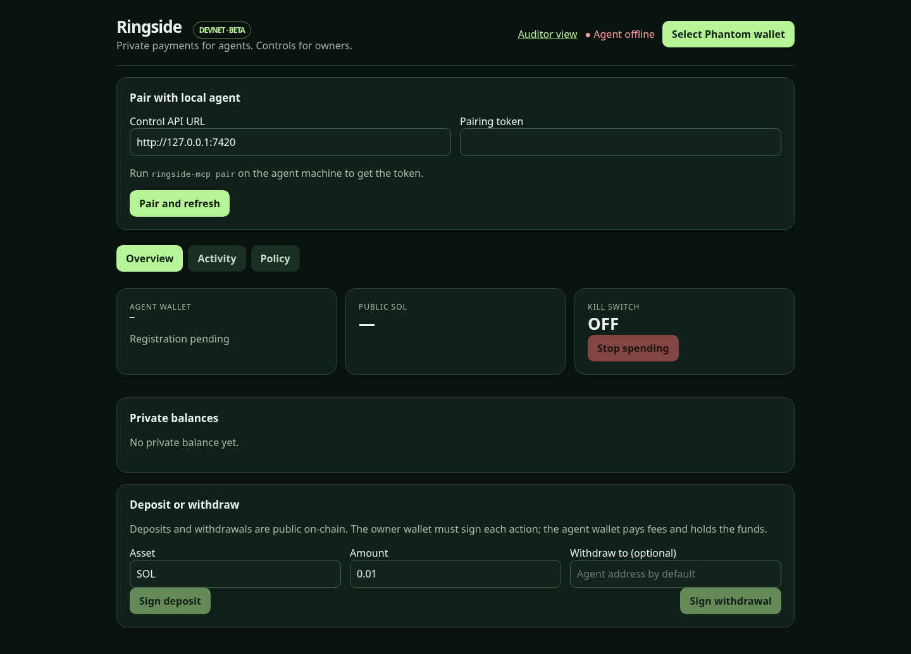
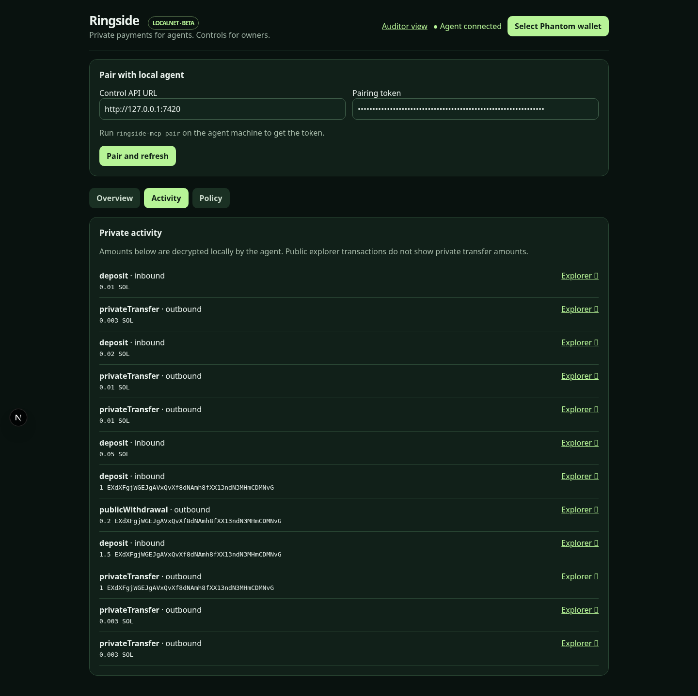
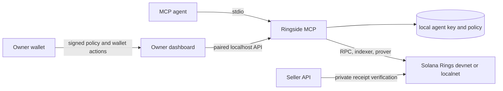

# Ringside MCP

Private agent payments on Solana Rings, with owner spending controls and seller verification. The MCP server runs on the agent's machine, keeps its keypair local, and works with Claude Desktop, Claude Code, Cursor, and other MCP clients. Solana **devnet is the target**; a complete SOL payment and seller flow has also passed on Zolana localnet while Helius devnet proof services are failing.





[PRD](PRD.md) · [Build status](STATUS.md) · [Reproducible demo steps](scripts/demo.md) · [Security model](docs/security.md)

## Install and connect

Use Node 24+ and pnpm 11. Clone and build:

```bash
git clone --recurse-submodules https://github.com/mayorXBT/Ringside-MCP.git
cd Ringside-MCP
pnpm install --frozen-lockfile
pnpm build
export HELIUS_API_KEY='your-devnet-key'
node packages/mcp/dist/index.js init --owner YOUR_OWNER_WALLET_ADDRESS
```

`init` prints a new agent address. Fund that **dedicated hot wallet** with devnet SOL before using spend tools. The owner wallet signs policy changes and never needs to be the agent fee payer. To use an existing funded Solana CLI keypair without copying it, run `RINGSIDE_KEYPAIR=/absolute/path/agent.json node packages/mcp/dist/index.js init --owner YOUR_OWNER_WALLET_ADDRESS --keypair /absolute/path/agent.json`. The key file must be mode 600 and stay outside Git.

Claude Desktop MCP config (replace both paths and the API key):

```json
{
  "mcpServers": {
    "ringside": {
      "command": "node",
      "args": ["--use-env-proxy", "/absolute/path/Ringside-MCP/packages/mcp/dist/index.js"],
      "env": {
        "HELIUS_API_KEY": "your-devnet-key",
        "RINGSIDE_KEYPAIR": "/absolute/path/agent.json"
      }
    }
  }
}
```

Use the same stdio command and environment in Claude Code or Cursor. `RINGSIDE_HOME` defaults to `~/.ringside`; keep it the same for the MCP process, CLI, seller API profile, and dashboard control API. The server is built from source today; `npx ringside-mcp` is not published yet.

## What is working

| Area | Tools and outcome |
|---|---|
| Wallet | `wallet_info`, `register_private_wallet` / `create_private_wallet`, `deposit`, `sync_balance` / `get_private_balance`, `read_history` / `get_private_history` |
| Spend | `private_transfer`, `withdraw`, `create_test_token`, `deposit_with_interface_setup` |
| Owner policy | `get_policy`; per-transaction, session, and rolling-24-hour caps, allowlists, read-only mode, kill switch; owner-signed writes through a localhost control API |
| Seller | `create_payment_request`, `pay_payment_request`, `verify_payment`; `/report` returned 402, then 200 after a private SOL payment, then rejected replay on localnet |
| Swap and escrow | Nine discoverable tools; **Tier C**, each returns `ENGINE_UNAVAILABLE`. The Rust stdio sidecar scaffold reports its unavailable state. No swap or escrow funds should be locked with this release. |

The core SOL deposit → private transfer → seller balance sync → withdrawal loop passed on localnet. SPL interface deposit and withdrawal, plus a one-unit seller payment, passed with a six-decimal local test token. Registration and deposits passed on devnet, but a transfer proof failed at the Helius prover/indexer. [STATUS.md](STATUS.md) records the errors and signatures. `RINGSIDE_RUN_LIVE_TRANSFER=1 pnpm check:live-transfer` retries a guarded transfer and withdrawal after proof service recovery. `RINGSIDE_NETWORK=localnet` selects the services started by `zolana dev start` on ports 8899, 8784, and 3001. [The demo runbook](scripts/demo.md) gives exact seed, seller API, MCP, and dashboard commands.

## Owner dashboard

[Open the Vercel preview](https://ringside-dashboard-livd2ydg0-mayors-projects-ed2d2592.vercel.app/) (Vercel Authentication protects this preview), or run `pnpm --dir apps/dashboard dev`. Pair with the token printed by `RINGSIDE_HOME=/path/to/buyer-home node packages/mcp/dist/index.js pair`. The dashboard reads the local agent at `127.0.0.1:7420`, displays private balances and history, and lets the configured owner wallet sign policy, kill-switch, deposit, and withdrawal actions. The `/audit` route is a read-only fallback using the local control API. Browser-side viewing-key decryption remains unverified. A hosted page may need Chrome for HTTPS-to-localhost access; include its exact origin in `RINGSIDE_DASHBOARD_ORIGINS` on the MCP process.

## Privacy and safety



Default Rings transfers conceal **asset and amount**, while sender, recipient, and transaction signature remain public. Deposits and withdrawals reveal their details on-chain: **funding is public; payments are private**. The server blocks mainnet URLs, keeps keys local, blocks transfers to unregistered recipients, and does not expose a policy-writing MCP tool. Spend tools carry destructive annotations. Swap/escrow example proving keys are insecure test keys and must never be treated as mainnet-ready.

## Comparison

| Approach | Agent interface | Owner controls | Seller receipt check | This release |
|---|---|---|---|---|
| Ringside MCP | Standard MCP stdio | Local caps, allowlists, signed policy, kill switch | `@ringside/verify` and demo 402 API | SOL flow verified on localnet; devnet proof path blocked |
| b402, ZeroK, SNAP, oracle | Existing privacy/payment approaches referenced in the PRD | Varies by project | Varies by project | Direct feature comparison needs a current review of each project |

Ringside's intended distinction is one MCP surface for the Zolana client, owner controls, and seller verification. The swap and escrow portion is documented Tier C, not a working comparison claim.

## Checks and limits

Run `pnpm check`, `pnpm test`, `pnpm build`, and `cargo test --manifest-path engine/Cargo.toml --locked`. The localnet demo uses `RINGSIDE_SEED_DEMO=1 pnpm seed:demo` and `RINGSIDE_RUN_SELLER_PAYMENT=1 pnpm check:seller`; both flags guard transactions. A full Claude Desktop devnet payment, actual USDC transfer and withdrawal, browser owner-wallet signing, and the escrow bounty demo remain unverified. See [STATUS.md](STATUS.md) for the current exit checklist.

The repo is MIT licensed. The upstream TypeScript examples are staged at `3d39626853fea338efc802896024cabda39ed4ab`; the PRD's `3069d79` commit was not available from the current remote. This server pins `@heliuslabs/zolana@0.3.1-alpha`, while the staged upstream examples use `0.4.0-alpha`.
